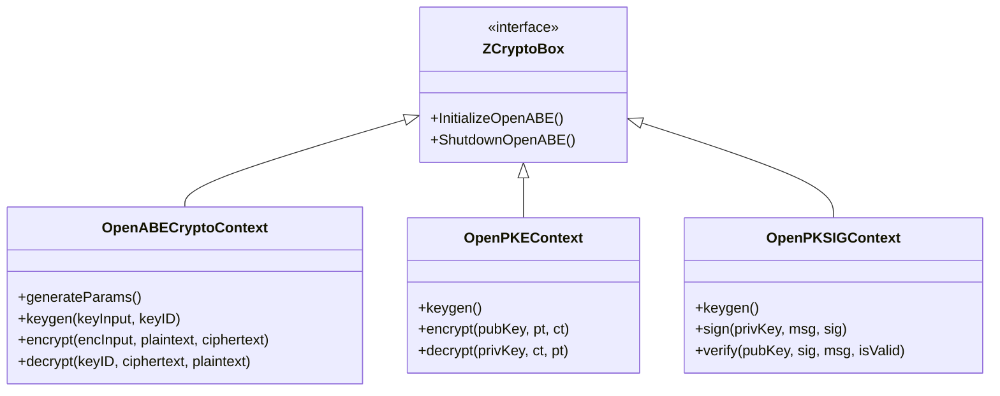
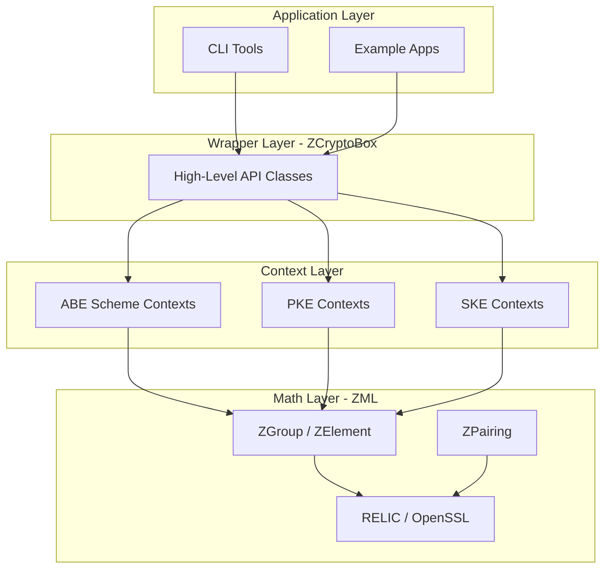
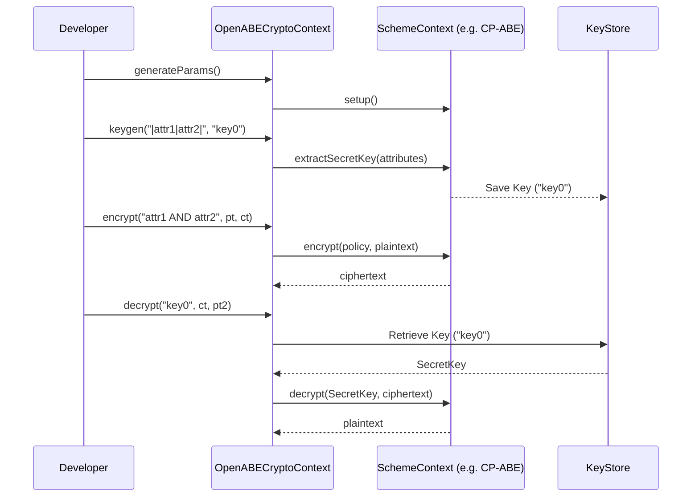

# Class Diagrams

This document provides a structural overview of OpenABE using Mermaid diagrams.

## High-Level API Architecture
The following diagram shows how the `ZCryptoBox` high-level wrapper interacts with the underlying scheme contexts.

## Layered Dependency Model
This diagram illustrates the dependency flow from the application level down to the mathematical primitives.

## ABE Workflow Sequence
A typical ABE encryption/decryption flow.

