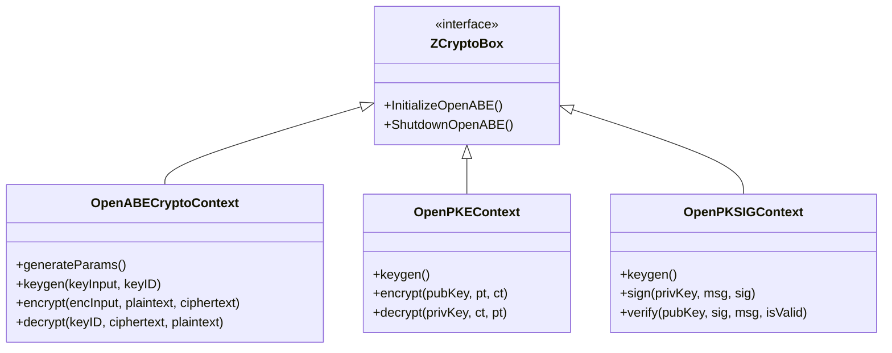
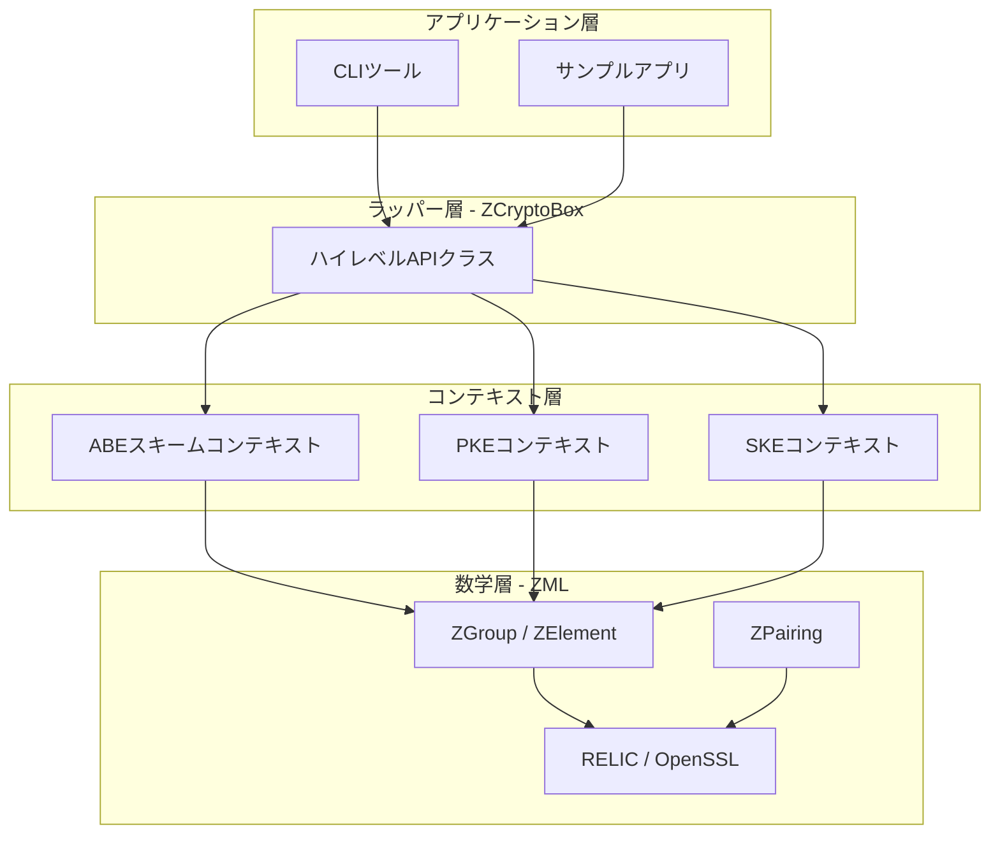
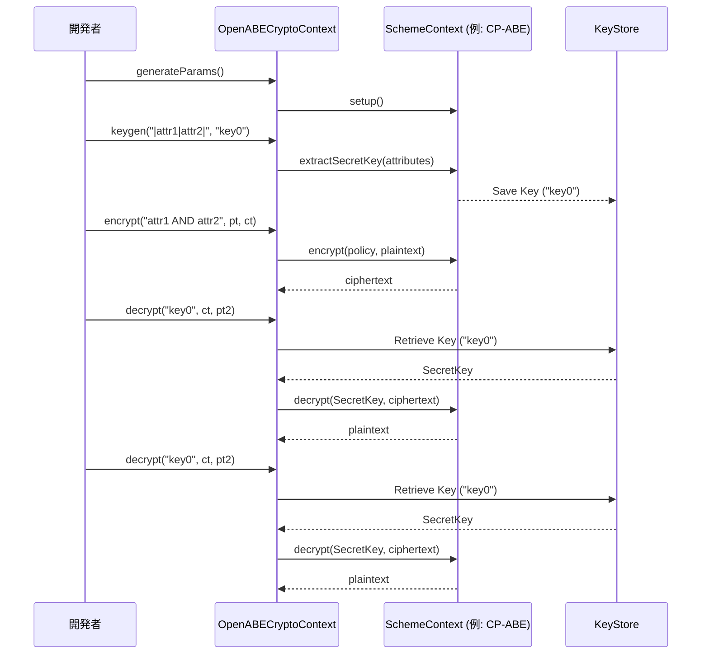

# クラス図

このドキュメントでは、Mermaidダイアグラムを使用してOpenABEの構造的な概要を示します。

## ハイレベルAPIアーキテクチャ
以下のダイアグラムは、`ZCryptoBox` ハイレベルラッパーが基底にあるスキームコンテキストとどのように相互作用するかを示しています。

## レイヤー依存関係モデル
このダイアグラムは、アプリケーションレベルから数学的プリミティブまでの依存関係の流れを示しています。

## ABE ワークフローシーケンス
典型的なABEの暗号化/復号の流れです。

